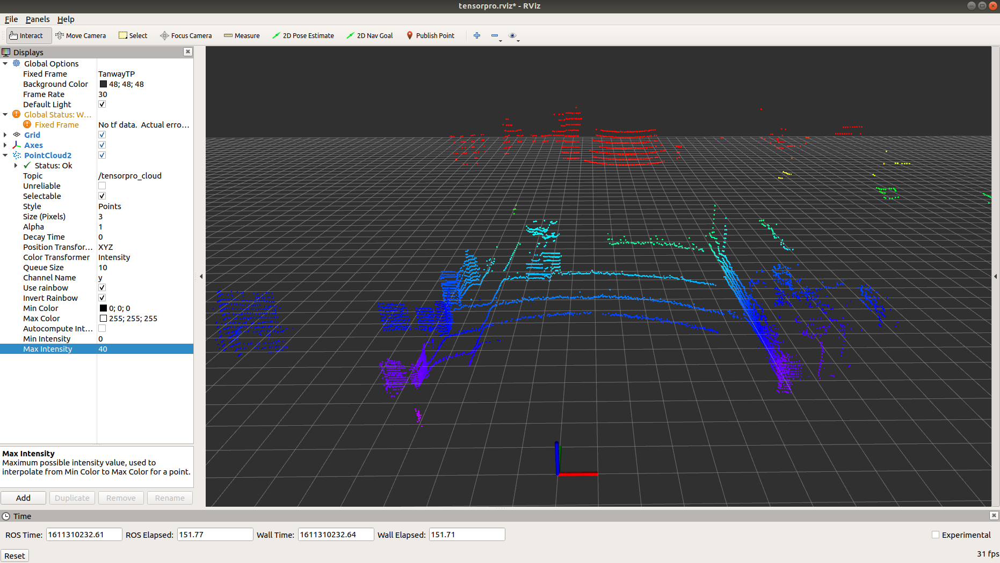
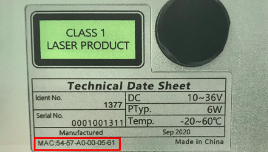

# tensorpro_view
TensorPro_PC_v1.1.7_20210122是探维科技TensorPro系列产品的上位机软件，在Ubuntu18.04环境下开发测试通过。

软件需在ROS环境下使用，ROS安装参见[安装教程](http://wiki.ros.org/ROS/Installation "")。

# 概览

[软件下载与编译](#软件下载与编译)

[点云显示软件使用](#点云显示软件使用)

[IP修改工具使用](#IP修改工具使用)


# 软件下载与编译

1. 打开终端（快捷键：ctrl+alt+T）

1. 创建ROS工作空间

```bash
mkdir -p ~/tensorpro_driver/src
cd ~/tensorpro_driver/src
```

1. 下载代码

```bash
git clone https://github.com/TanwayLab/tensorpro_view.git
```

输入用户名密码，下载成功后，～/tensorpro_driver/src文件夹下就会出现程序包。此步骤也可直接在github的项目下直接下载程序的zip压缩包，然后解压到/tensorpro_driver/src文件夹下。

1. 编译程序

```bash
cd ~/tensorpro_driver && catkin_make
```

1. 设置环境变量

```bash
echo "source ~/tensorpro_driver/devel/setup.bash" >> ~/.bashrc
source ~/.bashrc
```

# 点云显示软件使用

1. 修改电脑IP为与雷达通信的IP，默认为"192.168.111.204"

1. 正常查看点云

```bash
roslaunch tensorpro_view Tensorpro.launch
```




# IP修改工具使用

- 使用IP修改软件时，需关闭点云显示软件，运行下述命令运行程序

```bash
rosrun tensorpro_view tensorpro_interfaces
```

弹出用户交互界面如下,


### 验证连接

- 注意：使用此软件时，需关闭点云显示软件

- 激光雷达供电工作，利用网线将上位机与激光雷达连接，并将上位机IP地址设置为激光雷达数据发送的目的地址(默认为192.168.111.204)。

- 在“验证与雷达的通信”区域输入IP和端口信息（默认值为雷达出厂网络参数），点击“验证连接”。当连接正常且信息输入正确时，会出现如下图所示的状态栏显示，提示源数据来源和数据长度。


### 修改网络参数

- 建议关闭电脑的无线网络通信（Wi-Fi网络）

- 激光雷达供电工作，利用网线将上位机与激光雷达连接，并将上位机IP地址设置为激光雷达数据发送的原目的地址(默认为192.168.111.204)。

- 在“验证与雷达的通信”区域输入上位机IP和端口信息进行连接验证。此IP需与上位机IP一致，否则无法发送修改指令。

- 在“修改雷达和接受端信息”区域填写激光雷达的设备Mac信息、新设IP地址和端口信息，点击“确认修改”（因不同操作系统存在权限差异，可能会自动弹出终端要求用户输入密码获取权限，请及时输入用户密码以确保操作成功进行）。

- 激光雷达的设备Mac信息可在激光雷达主机侧面获取，此处只用于信息验证，不支持雷达MAC地址修改。



- 当连接正常且信息输入正确时，会出现如下图所示的状态栏显示，提示操作完成。**断开激光雷达电源，重新供电后新配置生效**。操作完成后，请使用本软件的验证功能或Wireshark等网络调试助手确认激光雷达IP信息修改成功。


### 参数说明
输入Mac地址、IP地址和端口信息应符合以下规则，否则将会出错。

- Mac地址从雷达主机侧面信息标签中读取

- IP地址范围为0.0.0.0至255.255.255.255

- 端口的范围为0至65535,建议端口号设置为大于1024的值

- 上位机与激光雷达IP地址应处于同一网段内

- 激光雷达设备出厂时，默认IP和端口号设计如下：

    上位机IP：192.168.111.204，上位机端口号：5600

    激光雷达IP：192.168.111.51，激光雷达端口号：5050

## 历史软件版本描述

| 版本号             | 时间          | 描述     | 
| ---------------------| ----------------- | ---------- |
| tensorpro_view v1.1.5 | 2020年6月1日 | 解析UDP数据包并发布为PointCloud2数据格式 | 
| tensorpro_view v1.1.6 | 2020年6月22日 | 修改buf数据类型为u_char | 
| tensorpro_view v1.1.7 | 2021年1月22日 | 增加距离/通道筛选功能| 